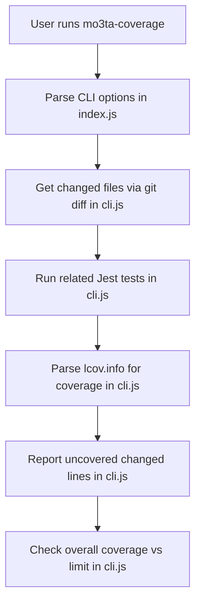

# mo3ta-coverage

**mo3ta-coverage** is a CLI tool for checking test coverage of changed lines in a pull request. It runs related tests, parses coverage reports, and ensures cumulative coverage meets a specified threshold—ideal for CI and code review workflows.

## Features

- Detects changed files between branches using `git diff`
- Runs related Jest tests for changed files
- Parses `lcov.info` for coverage data
- Reports uncovered changed lines
- Checks overall coverage against a user-defined limit

## Usage

```sh
mo3ta-coverage --base origin/main --lcov coverage/lcov.info --limit 80
```

## CLI Options

| Option         | Description                                                      | Default            |
|----------------|------------------------------------------------------------------|--------------------|
| `--base`       | Base branch to compare against                                   | `origin/main`      |
| `--lcov`       | Path to lcov.info file generated by test coverage tools          | `coverage/lcov.info`|
| `--limit`      | Minimum required coverage percentage for all changed lines       | `80`               |

## How It Works

1. **Parse CLI options** using [commander](https://www.npmjs.com/package/commander) in [`index.js`](index.js).
2. **Get changed files**: Uses `git diff --name-only <base>` to find modified JS/TS files ([`src/cli.js`](src/cli.js)).
3. **Run related tests**: Executes Jest for changed files with `--findRelatedTests` ([`src/cli.js`](src/cli.js)).
4. **Parse coverage**: Reads `lcov.info` to find uncovered lines ([`src/cli.js`](src/cli.js)).
5. **Report**: Prints uncovered changed lines and overall coverage ([`src/cli.js`](src/cli.js)).
6. **Enforce limit**: Exits with error if coverage is below the specified threshold.

## Architecture Diagram



## Example Output

```
Options: Base Branch: origin/main 
LCOV Path: coverage/lcov.info 
Coverage Limit: 80
🧪 Running tests related to changed files:
src/foo.js
src/bar.js
🚨 /abs/path/src/foo.js - Uncovered changed lines: [12, 15]
✅ /abs/path/src/bar.js - All changed lines are covered
   Total changed lines: 5, Covered: 5, Uncovered: 0
   Coverage for changed lines: 100.00%
🔢 Overall coverage for all changed lines: 85.71% limit is 80%
```

## License

MIT